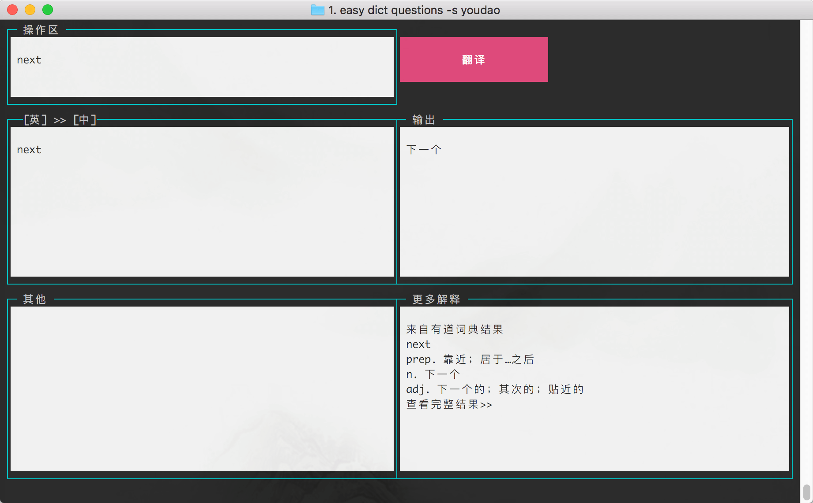
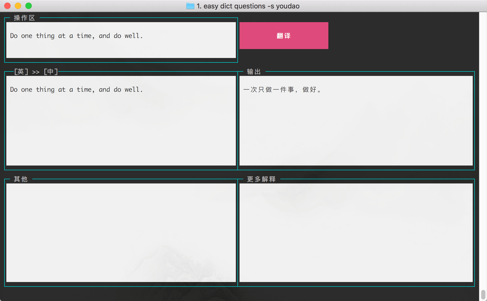
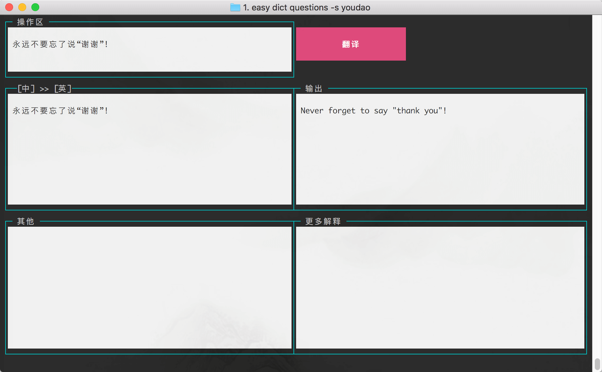

[](https://github.com/zhaoqize/easy-dict)
[](https://github.com/zhaoqize/easy-dict/blob/master/LICENSE)
[]()
# easy-dict
easy-dict 是一个可以直接在命令行界面中 **操作** 的词典

> 词库来源于 google 和 有道


### 安装
```js
npm install -g easy-dict
```

### 使用

它有两种使用方式

#### 1、命令行界面操作 （推荐✨）






**界面主要分为**

- 操作区：在这里输入你想要翻译的内容（支持复制）
  > 想要输入的时候：点击键盘上的 i 键位，启动输入模式
- 搜索按钮：点击后进行翻译
- 输入区：显示你要翻译的内容
- 输出区：显示翻译后的结果
- 其他区：显示词汇的定义（动词，名次等）的造句
- 更多内容区：显示词汇的其他解释

#### 在通过命令行操作
1、默认使用 `youdao` 翻译
```js
easy dict <word>
```

2、使用 `google` 词典
```js
easy dict <word> -s google
```

3、翻译英文单词
```js
easy dict question
```

4、翻译英文句子
```js
easy dict 'question is a question'
```

5、翻译中文单词
```js
easy dict 中国
```

6、翻译中文句子
```js
easy dict '我是中国人'
```


执行 `easy dict -h`
```js
  Usage: dict [options] <word>

  A Tool For Translaion

  Options:

    -s, --source <name>  default youdao, where is the source for dict
    -h, --help           output usage information
```

### TODO
- [ ] - 优化内容显示
- [ ] - 提高字典的稳定性
- [ ] - 提供界面皮肤自定义

### 如何贡献
1.拥有 GitHub 账户 (如果你还没有)

2.Fork 这个仓库

3.在你克隆的仓库上进行修改

4.提交一个 PR。

### License

MIT © [zhaoqize]()
